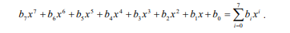

# Relatório FIPS-197: AES

# 1. Dicionário de termos e explicação

### AES

nome do padrão de criptografia

### Affine transformation - transformação afim

multiplicação por uma matriz e depois adição de um vetor

### Block - bloco

sequência de bits binários que compõem a entrada, saída, estado e a chave de rodada. É o conjunto de bits que vamos processar de uma só vez

### cypher - cifra

série de transformações que converte o texto plano em texto cifrado usando a chave de cifra. Processo que pega a entrada e transforma em um “código secreto”.

### chave de cifra

chave criptográfica secreta que é usada pela rotina de expansão de chave para gerar o conjunto de chaves da rodada. Pode ser visualizada como um array retangulas de bytes, contendo quatro linhas e um número Nk de colunas. Basicamente, é a “chave mestre” original, nunca será usada diretamente em nenhuma etapa de embaralhamento, mas serve de molde para as chaves de cada etapa.

### texto cifrado

resultado final da criptografia, texto que precisará de uma chave para ser decodificado

### cifra inversa

série de transformações que converte o texto cifrado em texto plano usando a chave de cifra.

### expansão de chave

uma rotina usada para gerar uma série de chaves rodada a rodada a partir da chave de cifra

### texto plano

texto de entrada para a cifra e ou de saída para a cifra inversa

### chave da rodada

são os valores derivados da chave de cifra por meio da rotina de expansão da chave. São aplicadas ao state, na cifra e na cifra inversa.

### s-box

tabela de substituição não linear usada em diversas transformações de substituição de bytes e na rotina de expansão da chave, serve para realizar uma substituição de um-para-um de um valor de byte

### estado

resultado intermediário da cifra que pode ser visualizado como um array retangulas de bytes, possui 4 linhas e um número Nb de colunas. Enquanto o texto está sendo transformado etapa por etapa, vai ser guardado nesse bloco que chamados de estado.

### palavra

grupo de 32 bits que é tratado como uma entidade única ou como um array de 4 bytes

# 2. Parâmetros de algoritmos, símbolos e funções

**AddRoundKey()
Definição:** Transformação na Cifra e Cifra Inversa na qual uma Chave de Rodada é adicionada ao Estado usando uma operação XOR. O comprimento de uma Chave de Rodada é igual ao tamanho do Estado.   

**Explicação:** É onde vamos fundir a mensagem parcial (Estado) com uma sub-senha específica daquela rodada, misturando ambas matematicamente para que ninguém reconheça a mensagem.

**InvMixColumns()**
**Definição:** Transformação na Cifra Inversa que é o inverso de MixColumns().   

**Explicação:** Função que "desmistura" as colunas, revertendo o embaralhamento vertical que foi feito originalmente para recuperar a organização dos dados.

**InvShiftRows()
Definição :** Transformação na Cifra Inversa que é o inverso de ShiftRows().   

**Explicação:** É como alinhar novamente as linhas que haviam sido rotacionadas, devolvendo cada pedaço exatamente para sua coluna original.

**InvSubBytes()
Definição:** Transformação na Cifra Inversa que é o inverso de SubBytes().   

**Explicação:** É a consulta ao "dicionário" de trás para frente. Entramos com o byte confuso à tabela e ela te diz qual era o byte original antes do disfarce.

**K**
**Definição:** Chave de Cifra (Cipher Key).   
**Explicação:** É o símbolo matemático que representa a “chave mestre”, aquela que geramos no início para proteger todo o sistema.

**MixColumns()**
**Definição:** Transformação na Cifra que pega todas as colunas do Estado e mistura seus dados (independentemente umas das outras) para produzir novas colunas.  

**Explicação :** Embaralha os dados na vertical. Ele dissolve e reorganiza os bytes de uma mesma coluna, espalhando a influência de cada pedacinho por toda a extensão daquela coluna.

**Nb**
**Definição :** Número de colunas (palavras de 32 bits) que compõem o Estado. Para este padrão, *Nb* = 4.   

**Explicação:** Representa a largura da "área de trabalho". No AES, a grade onde o algoritmo manipula seus dados sempre terá 4 colunas de largura.

**Nk**
**Definição :** Número de palavras de 32 bits que compõem a Chave de Cifra. Para este padrão, *Nk* = 4, 6 ou 8.   
**Explicação:** É o tamanho estrutural da "senha mestre". Quanto maior for esse número (4, 6 ou 8 colunas), mais comprida e indestrutível será a sua chave (128, 192 ou 256 bits).

**Nr**
**Definição :** Número de rodadas, que é uma função de *Nk* e *Nb*. Para este padrão, *Nr* = 10, 12 ou 14.   
**Explicação:** É a quantidade de "camadas de segurança". Se a chave for mais longa (*Nk* maior), o algoritmo obriga o dado a passar por mais etapas de embaralhamento (*Nr* maior).

**Rcon[]**
**Definição :** O array de palavras de constantes de rodada (round constant word array).   
**Explicação:** É como um “salt” fixo que o algoritmo adiciona durante a fabricação de novas chaves. Isso garante que duas rodadas diferentes nunca acabem usando chaves idênticas por coincidência, quebrando qualquer simetria que um hacker pudesse explorar.

**RotWord()**
**Definição :** Função usada na rotina de Expansão de Chave que pega uma palavra de quatro bytes e realiza uma permutação cíclica.   
**Explicação:** Vamos deslizar os 4 bytes: o byte que estava na primeira cadeira vai lá para o final, e todos os outros escorregam uma posição para a esquerda.

**ShiftRows()**
**Definição :** Transformação na Cifra que processa o Estado deslocando ciclicamente as três últimas linhas do Estado por offsets diferentes.   
**Explicação:** o *MixColumns* mistura os dados na vertical e o *ShiftRows* os mistura na horizontal. Ele desliza as fileiras do seu bloco de dados para os lados, espalhando as informações para garantir que partes antes próximas fiquem bem separadas.

**SubBytes()**

**Definição :** Transformação na Cifra que processa o Estado usando uma tabela de substituição de bytes não linear (S-box) que opera em cada um dos bytes do Estado de forma independente.

**Explicação:** É o momento em que o algoritmo disfarça os dados peça por peça, trocando intencionalmente cada byte original por um valor completamente diferente consultado em uma tabela fixa.

**SubWord()**

**Definição:** Função usada na rotina de Expansão de Chave que pega uma palavra de entrada de quatro bytes e aplica uma S-box a cada um dos quatro bytes para produzir uma palavra de saída.

**Explicação:** Faz o mesmo "disfarce" do *SubBytes*, mas focado estritamente na fábrica de senhas: ele substitui os 4 bytes da chave que está sendo criada de uma só vez para aumentar a aleatoriedade.

**XOR**

**Definição:** Operação Ou-Exclusivo (Exclusive-OR).

**Explicação:** compara bits: se você comparar dois valores iguais, o resultado é nulo (0). Se forem diferentes, o resultado é positivo (1). É o principal método para misturar chaves com textos de forma que possam ser desmisturados depois.

# Notations and Conventions

## inputs and outputs

1. tamanho fixo de dados: precisamos dividir as entradas em 128 bits, a saída também terá o mesmo tamanho de 128 bits. chamamos essas caixas de blocos.
2. tamanho da cipher key: podemos ter chaves mestre de 128, 192 ou 256 bits
3. os índices sempre começam de 0 e vão até 1 menos o tamanho da sequência. dependendo do tamanho da sua senha, a contagem vai de 0 a 127, de 0 a 191, ou de 0 a 255. Esse número de posição é o que chamamos de "índice" (*index*).

## bytes

1. sempre agrupamos os dados em pacotes de 8 bits. ou seja: 8 bytes
2. Por isso, fatiamos todos os blocos, desde a entrada até as chaves (que podem ser de 128, 192 ou 256) de 8 em 8 bits
3. Para identificar os tamanhos dos blocos, basta dividir por 8:
    1. **Para 128 bits:** Temos 16 bytes, numerados da posição 0 até a 15.   **Para 192 bits:** Temos 24 bytes, numerados da posição 0 até a 23.   **Para 256 bits:** Temos 32 bytes, numerados da posição 0 até a 31.  
4. Além disso, podemos denotar nossos bytes de 3 formas diferentes
    1. binário:  {01100011}
    2. polinomial 
        
        
        
    3.  hexadecimal {63}
        
        
        
5. Algumas operações levam a um bit adicional que transborda o byte normal e gera um bit extra no canto esquerdo. Quando isso acontece, aparecerá  um `{01}` solto na frente do número hexadecimal, criando um bloco de 9 bits para guardar essa "sobra" temporária. 
    1. for example, a 9-bit sequence will be presented as {01}{1b}

## Arrays of bytes

Como já visto, a entrada sempre terá 128 bits e usaremos uma chave de 128 bits também, teremos então as variáveis de input0 até input127. Para organizar, vamos dividir em arrays de bytes. Cada array contendo 8 bits consecutivos. 

A regra: 

1. guardamos do bit 0 até o 7 em a0; 
2. guardamos do bit 8 até o 15 em a1;
3. a2 abriga de 16 até 23
4. a15 abriga de 120 até 127

De modo que podemos usar a fórmula: para descobrir o primeiro índice de an, basta multiplicar n por 8: Por exemplo, no vagão 2 (*a2*), os bits começam no índice 16 (2 x 8).

## The state

Aqui entramos onde serão guardados os nossos estados, organizado de maneira a ter:

1. 4 linhas horizontais de 0 a 3 e representados pela letra r de row
2. e com 4 colunas verticais, pois dependem do símbolo Nb (são 4, pois no padrão AES o Nb é padronizado sendo 4) — é representado pela letra c de column


Na figura acima, podemos ver a correspodência entre os dados de entrada, saída e os dados guardados em state.

No começo do processo de cifra ou cifra inversa, o array de entrada in é copiado para o array state de acordo com o esquema 


- Ou seja, temos um preenchimento de cima para baixo, coluna por coluna:
- Ele pega os primeiros 4 bytes da fita (`in0` a `in3`) e os coloca na primeira coluna, descendo do topo até a base.
- Pega os próximos 4 (`in4` a `in7`) e preenche a segunda coluna de cima para baixo.   Faz isso até preencher todo o tabuleiro 4x4.

E no fim do processo da cifra e cifra inversa, o estado é copiado para o array out da seguinte maneira


- Então, no fim do processo de criptografia. Há simplesmente o recolhimento dos bytes  do mesmo jeito que colocou: de cima para baixo, coluna por coluna para formar a nova fita de saída embaralhada (*out*).

um exemplo de implementação em python

```python
# O padrão AES define Nb = 4 colunas para o Estado
Nb = 4

def copiar_para_estado(in_bytes):
    """
    Recebe uma lista linear (fita) de 16 bytes e 
    organiza no tabuleiro 4x4 do Estado.
    """
    # Cria uma matriz 4x4 preenchida com zeros
    state = [[0 for _ in range(Nb)] for _ in range(4)]
    
    # Preenche o Estado coluna por coluna
    for r in range(4):
        for c in range(Nb):
            # A fórmula r + 4c descobre qual item da fita vai para qual coordenada
            state[r][c] = in_bytes[r + 4 * c]
            
    return state

def copiar_para_saida(state):
    """
    Recebe a matriz 4x4 do Estado e recolhe as peças de volta 
    para uma fita linear de 16 bytes.
    """
    # Cria uma lista linear vazia com 16 espaços (4 * Nb)
    out_bytes = [0] * (4 * Nb)
    
    # Retira os bytes do Estado e os coloca na fita de saída
    for r in range(4):
        for c in range(Nb):
            # Usa a mesma fórmula r + 4c para recolocar os dados na ordem correta
            out_bytes[r + 4 * c] = state[r][c]
            
    return out_bytes
```

## 3.5 The state as an array of columns

Além de pordermos ver o Estado como uma grade de 16 quadradinho individuais guardando um byte, o algoritmo AES também permite enxergar o Estado como 4 grandes pilares verticais (ou seja, como colunas).

É aqui que retomamos a definição de word: aquele bloco maior formado extamente por 4 bytes ou 32 bits. É a coluna inteira do Estado de cima a baixo.

Damos nomes a cada word:

- A primeira coluna inteira recebe o apelido de **w0**.
- A segunda coluna inteira vira **w1**.
- A terceira vira **w2**.
- A quarta vira **w3**.

Ter uma organização em 4 pilares ao invés de 16 quadradinhos isolados facilita as operações que veremos mais a frente.

# 4. Mathematical Preliminaries

Todos os bytes no algoritmo AES são interpretados como elementos de corpos finitos usando a notação introduzida na seção 3.2. Os elementos de corpos finitos podem ser somados e multiplicados, mas fazemos isso com operações especiais.

## 4.1 Adição

Tanto a adição quanto a subtração são feitas utilizando a operação XOR. Na prática, quando o algoritmo precisa somar dois bytes, ele simplemente alinha os dois bytes um em cima do outro e compara a primeira posição do byte A com a primeira posição do byte B e guarda o resutado. Faz o mesmo com os indices subsequentes até o oitavo bit.

## 4.2 Multiplicação

Diferente da soma que usa apenas o XOR direto, a multiplicação no AES é mais complexa. Como em um byte cabe apenas 8 bits e ao multiplicar as representações algébricas dos dois bytes os expoentes se somam. Esse resultado não caberia nos 8 bits do byte original.

Por isso o algoritmo AES usa a operação “módulo” (o resto de uma divisão), e divide o número gigante obtido pela multiplicação por um divisor fixo, o que estabelece um limite.

O tal número divisor deve ser irredutível — indivisível — assim, o padrão AES usa o polinomio fixo 


em hexadecimal o valor é {01}{1b}.

Isso  garante  que a resposta final sempre volte a encolher para um tamanho menor que 8. Assim, o novo valor se encaixa perfeitamente dentro de um único *byte* legível pelo sistema.

Além disso, essa multiplicação é associativa e o elemento [01] é a identidade multiplicativa e para qualquer polinômio binário não nulo b(x), de grau menor que 8, o **inverso multiplicativo** de b(x), denotado por b^{-1}(x), pode ser encontrado da seguinte maneira: o **algoritmo estendido de Euclides** é usado para calcular polinômios a(x) e c(x) tais que


logo


o que significa que 


Segue-se que o conjunto dos **256 valores possíveis de um byte**, usando XOR como adição e a multiplicação definida acima, possui a estrutura do **corpo finito GF(2^8)**

Criptografando, é na transformação subBytes que encontraremos o inverso multiplicativo de um número em GF(2^8) e depois aplicar-se-à uma transformação afim (a partir da tabela S-box) aos bits desse resultado.

Já na descriptografia, temos o resultado criptografado, que passará por uma transformação afim e, aí sim, posteriormente encontraremos o inverso do inverso. Ou seja: o valor original. 

### 4.2.1 Multiplication by x

Multiplicar usando corpos finitos é complicado, pois precisamos calcular módulos e polinômios, por isso o AES usa a multiplicação por x (que equivale a {02}). Essa operação é feita no método xtime(), onde ao invés de fazer a álgebra complexa, o computador faz um deslocamento à esquerda de todos os bits e o bit à extrema esquerda cai fora, além de um novo 0 entrar na extrema direita.

Caso o b7 que jogamos fora for 0, o trabalho termina aí, mas se o bit jogado fora for 1, significa que a conta transbordou o limite do byte, então o computador pega o número atual e aplica um XOR contra o valor fixo {1b}, aquele polinômio de valor irredutível. Assim, teremos novamente o tamanho de 8 bits desejado.

É importante ressaltar o poder que o xtime() trás para o processo, já que ele se permite ser empilhado. O documento trás o exemplo: multiplicar por {02} é fácil, bastando usar xtime() uma vez, mas não é só isso. Se quisermos multiplicar por {04] é só pegar o resultado e passar por xtime() novamente. Se o desejo for multiplicar por {08], basta aplicar xtime() pela terceira vez.

O exemplo final do tópico mostra como é o processo de multiplicação de {57} por um número como {13}. O problema é quebrado em pedaços menores e mais fáceis de digerir, como na matemática binária {13} = {01} + {02} + {10} o algoritmo simplesmente calcula essas multiplicações simples em separado utilizando xtime() e no final soma os resultados parciais {57}, {ae} e {07} usando XOR, chegando à resposta final {fe}.

## 4.3 Polinomomials with coefficients in GF(2^8)

Nessa seção, ao invés de usar bits como foi demonstrado anteriormente como coeficientes, o AES passa a usar como coeficientes inteiros de um byte (ou seja: os elementos do corpo finito GF(2^8)).

Agora a equação de quatro termos abaixo 


nada mais é que a tradução matemática daquela coluna/palavra (word) que falamos anteriormente: elas possuem 4 bytes e estão representadas do Estado. Cada componente da coluna vira o coeficiente de uma parte do polinomio.

Quando é preciso somar dois polinomios desses (duas colunas inteiras) a regra é aquela que já vimos, uma operação XOR entre o bytes correspondentes de cada palavra.

Já a multiplicação é mais complexo e acontece em dois passos:

1. Multiplicar os termos algebricamente , o que faz os graus crescerem até potências maiores como x^6 mostrado abaixo
 
    
    <aside>
    💡
    
    **c(x) = a(x) • b(x)**
    
    </aside>
    


1. Redução (ou calculo de mod) por (x^4 + 1), já que o resultado pode estourar o limite de termos que o AES aceita, é preciso cortar o excesso. Agora usamos esse novo polinomio redutor. E a regra dele é ciclica: 
qualquer expoente maior que 3 dá a volta em ciclos de 4 (*x^4* vira *1*, *x^5* vira *x*, e assim por diante).

Essa operação descrita pode ser denotada como 


e é dada nos 4 termos definidos abaixo


com as equações sendo:


o que permite a representação em uma forma matricial, facilitando os calculos computacionais e permitindo a multiplicação de corpos finitos GF(2^8) com xtime()

```python
def xtime(a):
    """
    Implementa a função xtime() definida na Seção 4.2.1 do AES.
    Multiplica um byte por {02} em GF(2^8) usando shift e XOR condicional com {1b}.
    """
    # Se o bit mais alto (b7) for 1 (equivalente a a & 0x80), 
    # fazemos o shift à esquerda e um XOR com 0x1b.
    if a & 0x80:
        return ((a << 1) ^ 0x1b) & 0xFF
    else:
        return (a << 1) & 0xFF

def multiplicar_gf28(a, b):
    """
    Multiplica dois bytes 'a' e 'b' no corpo finito GF(2^8) 
    utilizando a função xtime() repetidamente (Seção 4.2.1).
    """
    resultado = 0
    
    # Processa cada um dos 8 bits do multiplicador 'b'
    for _ in range(8):
        # Se o bit menos significativo de 'b' for 1, 
        # acumulamos o valor atual de 'a' no resultado usando XOR (adição do corpo finito).
        if b & 1:
            resultado ^= a
            
        # Multiplicamos 'a' por x (ou seja, aplicamos o xtime para o próximo passo)
        a = xtime(a)
        
        # Deslocamos 'b' para a direita para analisar o próximo bit
        b >>= 1
        
    return resultado

# Exemplo de teste com os dados do documento:
# O documento mostra que {57} • {83} deve resultar em {c1}
val_a = 0x57
val_b = 0x83
res = multiplicar_gf28(val_a, val_b)

print(f"Resultado da multiplicação: {hex(res)}") 
# Saída esperada: 0xc1 (conforme exemplificado na Seção 4.2 do documento)
```

Esse será o coração da etapa MixColumns do algoritmo AES.

Além disso, o documento saliente que o redutor usado (x^4 + 1) não é irredutível e, por isso, a maioria das multiplicações de 4 termos nessa regra não pode ser desfeita. Por isso, um polinômio fixo a(x) específico que possui um gêmeo inverso a^{-1}(x) foi escolhido

1. para criptografar (MixColumns) usa
    
    
    
2. Já para descriptografar (InvMixColumns) usa 
    
    
    

Ainda é explicado que a função de rotacionar os bytes da chave “RotWord” é apenas um caso especial dessa mesma matriz, usando um polinômio x^3.

# 5. Algorithm Specification

O algoritmo apera definindo 3 coisas:

1. O bloco, denotado por (Nb = 4): Define o tamanho dos dados que entram e saem e é sempre fixo em 128 bits, o que equivale exatamente às 4 colunas da matriz de Estado.
2. A chave (Nk = 4, 6 ou 8): É a senha mestre e pode ter tamanhos diferentes de 128, 192 ou 256 bits e medidos em palavras de 4 bytes
3. As rodadas (Nr = 10, 12 ou 14): Podem ser descritas como as “camadas” que os dados precisam atravessar. Quanto mais longa a senha, mais vezes o algoritmo vai embaralhar os dados para garantir que a segurança seja proporcianalemtne maior.

Tanto na cifração quando na decifração o AES usa 4 transformações diferentes:

1. substituição de bytes utilizando uma tabela de substituição (S-box), 
2. deslocamento das linhas da matriz de Estado por diferentes deslocamentos → ShiftRows()
3. mistura dos dados em cada coluna da matriz de Estado → MixColumns()
4. adição de uma Chave de Rodada ao Estado → AddRoundKey()

## 5.1 Cipher

Primeiro de tudo, a entrada é copiada para o arranjo de Estado usando as convenções descritas na seção 3.4;

Passamos então para as rodadas:

1. **AddRoundKey** inicial: antes de qualquer rodada começar de fato, o tabuleiro de estados sofre um XOR com a primeira parte da chave
2. **Rodadas** em si que acontecem (Nr - 1) vezes: os dados passam repetidamente por 4 etapas seguidas
    1. Substituição de bytes (subBytes)
    2. Deslocamento de linhas (ShiftRows)
    3. Mistura de colunas (MixColumns)
    4. Adição de chave da rodada (AddRoundKey)
3. **Rodada Final:** Na última rodada o algoritmo faz quase tudo igual, mas pula o MixColumns. Essa é a característica que garante que o processo seja reversível na hora de descriptografar.

Temos inclusive um pseudocódigo do cipher apresentado no documento


### 5.1.1 SubBytes() Transformation

A transformação SubBytes() é uma substituição de bytes **não linear** que opera independentemente em cada bye do Estado usanndo aquela tabela S-box, uma tabela de substituição. Esta S-box é inversível e é construída compondo duas transformações


1. Transformação 1: Obter o inverso multiplicativo do byte no corpo finito GF(2^8), descrito na seção 4.2; sendo que o elemento {00} é mapeado para ele mesmo
2. Aplicar a transformação afim sobre GF(2)
    1. Aqui, o inverso passará por uma matriz de rotação e deslocamento de bits específicos, somando no final uma constante fixa (o byte {63} em hexadecimal)
        
        
        
        Matricialmente, essa transformação afim pode ser expressa como:
        
        
        

No fim, guardamos essa tabela S-box de maneira estática para usar quando necessário. Se Estado tem o byte {53} em determinada posição, então:

1. O computador olha a tabela da S_box
2. Cruza a linha 5 com a coluna 3
3. O valor que estiver nessa intersecção na tabela substitui imediatamento o {53} no antigo Estado

### 5.1.2 ShiftRows() Transformation

Aqui, ao invés da alteração interna de cada byte individualmente (como ocorre no SubBytes), haverá uma mudança na posição dos bytes dentro do tabuleiro de Estado (State), agindo exclusivamente nas linhas horizontais. De maneira que:

1. A linha (r=0) não sofre nenhuma alteração;
2. Escalonamento: As três linhas restantes deslizam para a esquerda de forma progressiva e cíclica
    1. Linha 1 (r = 1) - desloca 1 posição para a esquerda e o byte que estava na primeira coluna vai para o final da fila (à direita)
    2. Linha 2 (r = 2) - Desloca 2 posições para a esquerda. Os dois primeiros bytes dão a volta e vão parar no lado direito.
    3. Linha 3 (r = 3): Desloca 3 posições para a esquerda. Os três primeiros bytes dão a volta para o lado direito.
    

Essa rotação horizontal garante que os bytes fiquem totalmente desalinhados em relação às colunas originais. Como resultado, quando a próxima etapa (*MixColumns*) for executada, os dados originais estarão espalhados por diferentes colunas, maximizando a difusão e a complexidade do AES.

### 5.1.3 MixColumns() Transformation

Essa transformação é vertical e age nas colunas de cima para baixo. 

Aqui, o algoritmo pega cada uma das 4 colunas do Estado e as enxerga como um polinomio de 4 termos (como vimos na seção 4.3).

Cada coluna é multiplicada por uma matriz fixa de constantes baseada no polinomio a(x) dado por 


Essa multiplicação usa as regras de corpos finitos GF(2^8) e o redutor x^4 + 1 e por isso pode ser escrita como:


Matricialmente


Como resultado dessa multiplicação, os 4 bytes de uma coluna são substituídos por:


O que acontece é que essa multiplicação faz com que o valor de um único byte se espalhe e contamine todos os quatro bytes daquela coluna, formando uma amalgama.

### 5.1.4 AddRoundKey() Transformation

Antes embaralhamos os dados do texto e agora vamos fundir a nossa senha secreta **Round Key** no Estado

Essa operação é bem direta, utilizando apenas a operação lógica XOR bit a bit. Cada coluna da matriz de Estado é combinada com uma palavra específica do cronograma de chaves correspondente àquela rodada.

Lembrando que no round = 0 ocorre uma adição inicial da chave logo na entrada, antes das rodadas de embaralhamento do texto

Durante as rodadas  ($1 \le \text{round} \le Nr$) A Round Key encerra o ciclo de cada rodada, com a operação XOR bit a bit

O uso do XOR é feito por ele ser seu próprio inverso, já que ao aplicar XOR duas vezes com o mesmo valor, o dado original retorna. O que permite que a mesma função AddRoundKey() possa ser usada tanto na criptografia quanto na descriptografia

## 5.2 Key Expansion

É importante ressaltar que o AES nunca usa a senha principal diretamente em todas as rodadas, a senha mestre K serve para uma Key expansion que produz um conjunto de sub-chaves chamadas de Round Keys. Cada rodada da criptografia exige pedaços específicos dessas chaves.

O número total de words de 4 bytes geradas é dados por Nb * (Nr + 1). No AES de-128 (NB = 4, Nr = 10), então será preciso produzir 4 * 11 (44) palavras encadeadas

O procedimento usa três funções já citadas

1. RotWord() que desloca os 4 bytes de uma palavra ciclicamente para a esquerda
2. SubWord() que passa cada um desses bytes pela tabela S-box para disfarcá-los não linearmente
3. Rcon[] uma tabeela de constantes baseada em potencias de x (usando o xtime()), inserindo algo de diferente a cada rodada, o que garante que duas etapas nunca usem chaves identicas

No fim, existem 3 regras: 

as primeiras palavras de (0 até Nk -1 ) recebem exatamente a senha original. 

As palavras seguintes então são geradas combinando a palavra anteriro com a palavra que ficou Nk posições atrás usando um XOR. 

Mas, quando o índice chega a um múltiplo de Nk (nas "viradas" de bloco da chave), a palavra anterior passa obrigatoriamente pela rotação (`RotWord`), pelo disfarce da S-box (`SubWord`) e sofre um XOR com a constante de rodada (`Rcon`) antes de continuar. 

Tudo isso é demonstrado pelo pseudocódigo abaixo:


## 5.3 Inverse cipher

A descriptografia é feita na ordem inversa da criptografia e com funções inversas. De modo que passamos por InvSubBytes(), InvShiftRows() e InvMixColumns(). O processo será feito de trás pra frente, da rodada 10 até a primeira.

Como já falado anteriormente, a adição da chave de rodada usa apenas a operação lógica XOR, então não precisa de nenhuma alteração especial.

Podemos ver no pseudocódigo abaixo também:


### 5.3.1 InvShiftRows() Transformation

Na criptografia o shiftRows deslocava as linhas para a esquerda, aqui InvShiftRows() fará o contrário para restaurar a ordem original, de modo que:

1. A linha r=0 permanece sem alterações
2. As três últimas linhas deslizam ciclicamente para a direita de forma espalhada ao processo de criptografia
    1. linha r = 1 → desloca 1 posição para a direita, assim o byte quue estava no fim da linha pula para a primeira coluna
    2. a linha r =2 → desloca 2 posições para a direita
    3. linha r = 3 → desloca 3 posições para a direita

### 5.3.2 InvSubBytes() Transformation

Antes usamos SubBytes para embaralhar o bytes do tabuleiro, agora usamos InvSubBytes() para recuperar os valores originais.

Assim como na ida, o AES não faz as contas matemáticas do **inverso multiplicativo** + **inversa da transformação afim** em tempo de execução para descriptografar, mas utiliza uma tabela estática pré-calculada **S-box Inversa** demonstrada abaixo:


### 5.3.3 InvMixColumns() Transformation

Aqui temos o inverso de MixColumns(), assim como na criptografia a inversão é feita multiplicando cada coluna do Estado por uma matriz fixa de polinomios. Sendo que dessa vez os coeficientes são os inversos


O que poderá ser escrito como a multiplicação matricial abaixo


e representado matricialmente assim:


Como resultado, os bytes das colunas do Estado serão substituídas por:


### 5.3.4 Inverse of the AddRoundKey() Transformation

como já visto antes, usaremos a mesma AddRoundKey() já descrita, dado que a inversa é a mesma aplicação do XOR

### 5.3.5 Equivalent Inverse Cipher

Para que a descriptografia siga a exata mesma sequência de blocos que a criptografia original usa e otimizar o chip, podemos usar duas propriedades:

1. **Comutatividade**: garante que fazer  **InvSubBytes()** seguido de **InvShiftRows()** dá exatamente o mesmo resultado do que fazer na ordem inversa. Portanto, podemos trocar a ordem delas de lugar no código para alinhar com o fluxo da criptografia.
2. **Linearidade do MixColumns:** Por conta dessa propriedade, podemos empurrar InvMixColumns() para depois de AddRoundKey() dentro das rodadas

<aside>
💡

lembrando que as etapas do cipher seguem exatamente a seguinte ordem

1. **AddRoundKey** inicial: antes de qualquer rodada começar de fato, o tabuleiro de estados sofre um XOR com a primeira parte da chave
2. **Rodadas** em si que acontecem (Nr - 1) vezes: os dados passam repetidamente por 4 etapas seguidas
    1. Substituição de bytes (subBytes)
    2. Deslocamento de linhas (ShiftRows)
    3. Mistura de colunas (MixColumns)
    4. Adição de chave da rodada (AddRoundKey)
3. **Rodada Final:** Na última rodada o algoritmo faz quase tudo igual, mas pula o MixColumns. Essa é a característica que garante que o processo seja reversível na hora de descriptografar.
</aside>

Para o uso do Equivalente Inverse cipher, mais lógica deve ser adicionada no fim da Key Expansion Routine que vimos em 5.2


Vejamos o pseudocódigo completo do Equivalent Inverse Cipher. 


### observações

o uso do Equivalent Inverse Cipher trará um benefício de otimização de área de silício e reuso de hardware. 

De modo que codificação ficará mais simples por conta do reuso do datapath: na descrição poderemos instanciar um único pipeline de processamento físico, usando os mesmos registradores, os mesmos blocos lógicos de substituição e as mesmas portas de mistura de colunas que servirão tanto para o modo de criptografia quanto para o de descriptografia. Além disso, o controle por meio da FSM não precisa mudar de direção ou reorganizar os barramentos de dados a cada rodada. O fluxo de dados sempre caminha na mesma direção.

Além da economia na área, já que não haverá duplicação circuitos para o roteamento reverso e, por consequência, gastaremos menos potência.