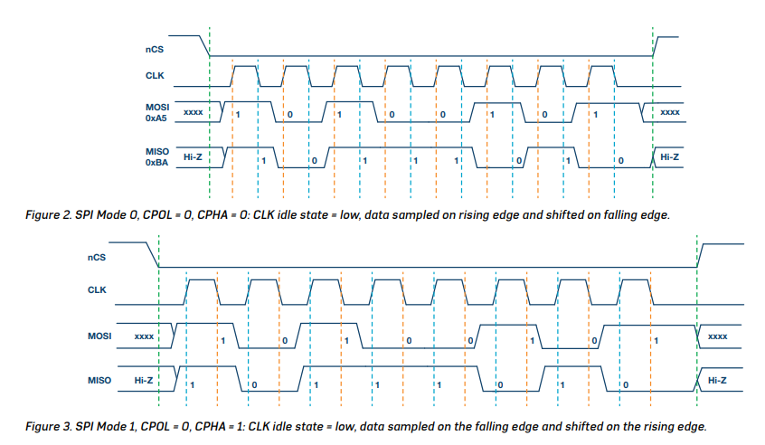

# Relatório Introduction to SPI Interface

SPI é uma interface de comunicação

1. Síncrona: depende do sinal clk como referência
2. Full-duplex: com capacidade de enviar e receber dados ao mesmo tempo em vias separadas
3. Master-slave: possui uma arquitetura de comunicação onde o dispositivo mestre dita o ritmo e comanda e rede e os escravos respondem aos seus comandos
4. Sincronizado na borda de subida ou de descida do clock
5. Pode funcionar com 3 fios ou 4 fios 

# Interface

4-wire SPI possui quatro sinais, sendo eles:

1. SCLK (SERIAL CLOCK) — dita a velocidade e momento exato em que os bits de dados devem ser lidos ou alterados nas linhas de dados
2. CS (CHIP SELECT) — é o sinal de seleção. Como o barramento SPI pode ter vários chips conectados, é esse fio quem ativa um escravo específico para conversar e desativa os outros
3. MOSI (MAIN OUT) — É a saída do mestre, onde ele envia dados e comandos para o escravo
4. MISO (MAIN IN) — É a entrada do mestre e o fio de retorno para recebimento de respostas ou dados pelo mestre.

**Frequência de clock:** o SPI é conhecido por suportar velocidades de transmissão de dados altas em comparação a outras interfaces seriais como I2C.

**Sinal ativo em baixo (activo low):** É a lógica de controle utilizada comumente, de modo que quando o pino está em nível alto  (tensão de alimentação, ex: 3.3V ou 5V), o sinal está "desligado" ou inativo). Para que se ative a função a seleção do chip se dá em nível baixo (0V ou GND).Por isso o nome $\overline{\text{CS}}$ vem barrado.

# Data Transmission

O handshake inicial se dá jogando o pino CS de um chip específico para 0 (CS = 0). Em seguida, o mestre começa a gerar os pulsos de clock por meio do **SCLK**. 

A transmissão é simultânea, então enquanto o mestre envia um bit para o escravo pelo fio MOSI, o escravo pode enviar ao mesmo tempo um bit pelo fio MISO.

> **Termos usados na transmissão

Shifting (deslocamento):** É o momento em que o chip coloca um novo bit (0 ou 1) na linha de dados para o outro ler

**Sample (amostrar/ler):** É o instante exato em que o chip olha para a linha de dados para capturar e registrar o bit que está chegando
> 

Lembrando que há flexibilidade de seleção sobre o uso de bordas de descida ou subida do clock para amostrar e/ou enviar dados.

# Clock Polarity and Clock Phase

1. CPOL (POLARIDADE DO CLOCK) → Define como o sinal de clock SCLK se comporta quando está ocioso (quando nenhuma transmissão está ocorrendo ou nos intervalos entre as mensagens)
    1. Se CPOL = 0, o clock fica em nível baixo (0V) quando ocioso
    2. Se CPOL = 1, o clock fica em nível alto (Tensão de alimentação) quando ocioso

<aside>
💡

O estado ocioso é definido como o período em que o CS está em nível alto e transiciona para baixo no início da transmissão, e quando o CS está em nível baixo e transiciona para alto no final da transmissão.

</aside>

1. CPHA (FASE DO CLOCK) → Define em qual borda do pulso de clock (a borda de subida ou de descida) os dados são lidos e deslocados

> A combinação de CPOL E CPHA determina exatamente qual das ações de ler ou enviar acontece na primeira borda do pulso e qual acontece na segunda bora
> 

Podemos ver a combinação desses dois bits na tabela abaixo em 4 modos de operação

| MODO SPI | CPOL | CPHA | POLARIDADE NO ESTADO OCIOSO | O QUE ACONTECE NAS BORDAS DE CLOCK |
| --- | --- | --- | --- | --- |
| 0 | 0 | 0 | Nível baixo | Dados são lidos na borda de subida e deslocados na borda de descida |
| 1 | 0 | 1 | Nível Baixo | Dados são lidos na borda de descida e enviados na borda de subida |
| 2 | 1 | 0 | Nível Alto | dados são lidos na borda de descida e deslocados na borda de subida |
| 3 | 1 | 1 | Nível Alto | dados são lidos na borda de subida e deslocados na borda de descida |

> **Regra:** O microcontrolador (mestre) e o periférico (subnó) **precisam obrigatoriamente estar configurados no mesmo modo SPI**. Se o mestre falar no Modo 0 e o subnó esperar o Modo 3, os dados lidos serão pura "lixeira" (ruim/corrompidos), porque eles vão tentar ler o relógio em momentos completamente diferentes.
> 

# Interpretando os diagramas de tempo

**LINHA VERDE** - Indica o início e o fim da transmissão

**LINHA LARANJA -** Borda de amostragem, ou momento em que o dado é lido

**LINHA AZUL -** Borda de deslocamento, ou momento em que o dado é atualizado e enviado

Os dados trafegando são mostrados nas linhas MOSI e MISO

> 
> 
> 
> **Figura 2 - MODO SPI 0 com cpol =0 e cpha = 0**
> 
> CLK começa em 0, o que significa que seu estado ocioso é 0. Isso ocorre, pois a polaridade do clock CPOL = 0
> 
> CPHA = 0 indica que os dados são amostrados na borda de subida e deslocados na borda de descida
> 

> **Figura 3 - Modo SPI 1 (CPOL = 0, CPHA = 1)**
Assim como no Modo 0, a polaridade do clock é 0, o que indica que o estado ocioso do sinal de clock é baixo.   

A fase do clock (CPHA) é 1, o que indica que os dados são amostrados na borda de descida. A figura mostra isso através da linha pontilhada laranja.   

Os dados são deslocados na borda de subida do sinal de clock. A figura mostra isso através da linha pontilhada azul.
> 

> **Figura 4 - Modo SPI 2 (CPOL = 1, CPHA = 0)**
Aqui a polaridade do clock (CPOL) é 1, o que indica que o estado ocioso do sinal de clock é alto. Vemos que sinal de CLK já começa lá em cima.   

A fase do clock (CPHA) é 0, o que indica que os dados são amostrados na borda de descida. Novamente, isso é mostrado pela linha pontilhada laranja.   

Os dados são deslocados na borda de subida do sinal de clock. A linha pontilhada azul ilustra esse momento.
> 

> **Figura 5 - Modo SPI 3 (CPOL = 1, CPHA = 1)**

A polaridade do clock (CPOL) é 1, indicando que o estado ocioso do sinal de clock é alto.   

 A fase do clock (CPHA) é 1, o que indica que os dados são amostrados na borda de subida. O momento exato é apontado pela linha pontilhada laranja.   

Os dados são deslocados na borda de descida do sinal de clock. Isso é evidenciado pela linha pontilhada azul.
>